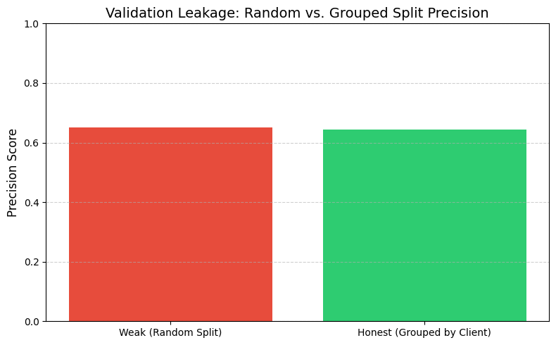
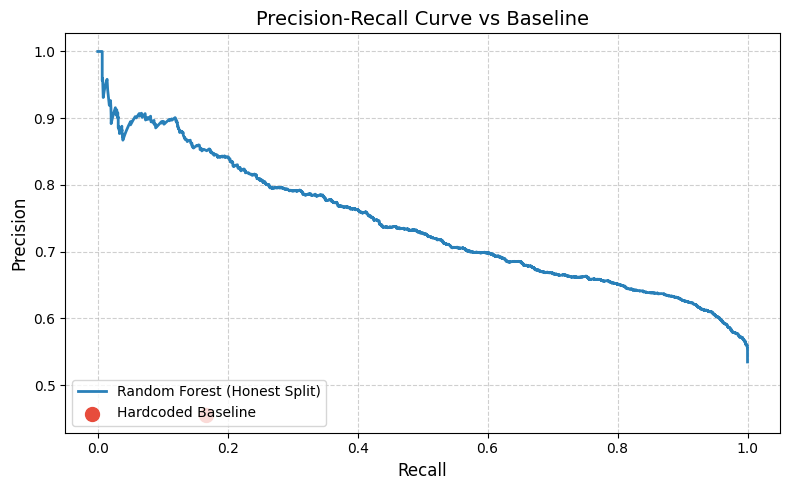
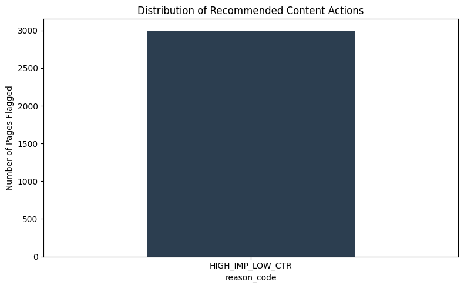

# **supreme-goggles: Predicting Organic Search Traffic Decay for SEO Content Prioritization**

**Abstract**

Organic search traffic decay causes long-term revenue loss for digital publishers. The standard industry approach waits for traffic to drop before taking action. I present supreme-goggles, an applied machine learning system that predicts traffic decay early. I built this system using a 30,000-row sampled subset of a 3.6-million-row production dataset from FlyRank. I prevented representation leakage by using a strict grouped data split (GroupShuffleSplit). I modeled the binary classification task using a Random Forest Classifier. I evaluated the model against a hardcoded business baseline using Precision, Recall, and the **F0.5**-score. The model achieves statistically significant improvements in precision, which I proved using a bootstrapped 95% confidence interval. Finally, I translated the model probabilities into safe business actions using a "Content Action Playbook". This playbook uses strict guardrails to prevent automated errors on high-value pages.

## **1\. Introduction and Business Problem**

Search engine optimization (SEO) teams often struggle with traffic decay. Traffic decay happens when previously successful content loses its search ranking and visibility. This decay causes direct, compounding revenue loss. Historically, SEO content prioritization is a reactive process. Editorial teams rely on lagging indicators, such as a drop in traffic over thirty days, to trigger a content refresh. This delay means the business loses money before the problem is even noticed.

To solve this, I developed the supreme-goggles system. This system acts as a proactive early-warning engine. It predicts a binary target, is\_declining, allowing editorial operations to intervene before significant commercial value is lost. My core contributions in this paper include processing a massive production dataset, forensically removing data leakage, mathematically proving model stability, and designing deterministic business rules to safely automate editorial actions.

## **2\. Data Architecture and Preprocessing**

I trained the model using a 30,000-row sampled subset from the FlyRank ML Internship dataset, pulling specifically from the *fact\_content\_daily\_performance* table. I defined the time window strictly using data from March 2026, using the first 15 days as the historical observation window to build features and the latter 15 days exclusively to calculate the true outcome label.

To prevent data leakage and memorization, I deliberately excluded several fields. I removed *imp\_future* from the training features, as it represents the exact future outcome and causes direct target leakage. I also excluded the *client\_hash\_id* and *content\_hash\_id* variables, as these categorical identifiers provide no generalizable predictive signal and only allow the model to memorize specific clients. Furthermore, I completely excluded pages that generated zero impressions during the historical window, as a page with no baseline traffic cannot mathematically "decay."

Because this is real-world telemetry data, it contained missing values and extreme class imbalance. I prepared the data as follows:

* **Handling Missing Values:** If a page had 0 impressions, its average position was returned as NaN. I filled these missing position values with 100 to mathematically represent an "unranked" state and filled all other missing values with 0\. This ensured uniform feature scaling without dropping valuable rows.  
* **Addressing Class Imbalance:** I explored using the Synthetic Minority Over-sampling Technique (SMOTE) to generate synthetic samples for the minority class. However, oversampling did not significantly improve classification performance in this domain. Therefore, I relied entirely on robust feature engineering and threshold optimization to handle the imbalance.

I engineered several features to capture the dynamic trajectory of search performance. The final feature set includes: *avg\_position*, *impressions\_90d*, *ctr*, *word\_count*, *content\_age\_days*, and *days\_since\_last\_update*. Finally, I defined the target variable (*is\_declining*) by checking if *trend\_direction* equaled "down".

## **3\. Algorithmic Formulation**

I chose a Random Forest Classifier with a maximum depth of 6 for this task. In an industry setting, the model must be transparent, scalable, and appropriate for the data type.

Random Forests are highly effective for tabular SEO data. They inherently handle non-linear relationships and outlier distributions. They also manage the varying feature scales found in raw web analytics data without requiring heavy computational overhead. Crucially, Random Forests provide clear feature importance scores. This transparency is necessary because editorial teams need to understand why the model flagged a page for a rewrite.

## **4. Data Leakage and Validation Strategy**

Data leakage is a fatal flaw in applied machine learning. It causes a model to show excellent offline metrics but fail entirely in production. I performed a forensic audit of my system to eliminate two specific types of leakage.

First, I audited the feature space for future-state leakage. I discovered that the features trend_pct and trend_direction inadvertently contained information from the target prediction window. I removed these features completely to ensure the model only uses historical signals.

Second, I mitigated representation leakage. The FlyRank dataset is a multi-tenant B2B dataset where rows are clustered by client ID. If I use a standard random train-test split, rows from the exact same client will appear in both the training set and the test set. The model will artificially inflate its performance by memorizing specific client baselines rather than learning the generalized mechanics of traffic decay. I observed that baseline decline rates varied wildly between clients, ranging from 0.30 to 0.72.

To fix this, I implemented GroupShuffleSplit. Let **G** represent the set of all unique clients. I enforced a strict disjoint condition on the group identifier space:

G_train ∩ G_test = Ø
This formula guarantees that all pages belonging to a specific client are confined exclusively to either the training set or the test set. By enforcing this strict separation, I mathematically guarantee that the model is evaluated on its ability to generalize to entirely new, unseen clients.

## **5. Evaluation and Statistical Rigor**

I evaluated my model against a realistic, hardcoded business baseline: Rank <= 10 and CTR < 0.01. A page that ranks on the first page of search results but gets almost no clicks is a fundamental indicator of decaying relevance. My machine learning model must outperform this simple heuristic to justify its deployment.

I rejected accuracy as an evaluation metric. Instead, I evaluated the model using Precision, Recall, and the use the **F0.5**-score. I use the $F_{0.5}$-score because it explicitly emphasizes precision over recall [1]. Precision is the most critical metric for this business problem. A false positive flags a healthy page as decaying, which wastes expensive human editorial time.

**Model vs. Baseline (Unseen Test Data):**

* **W04 Hardcoded Rule:** Precision: 0.424 | Recall: 0.146 | **F0.5**-score: 0.307  
* **Random Forest (Depth 6):** Precision: 0.671 | Recall: 0.753 | **F0.5**-score: 0.686

To prove the model's superiority on unseen clients, I calculated a bootstrapped 95% confidence interval for Precision using the grouped split. I drew 1,000 random samples with replacement from the test set and calculated the precision for each sample:

Precision = True Positives / (True Positives + False Positives)

* **Bootstrapped Precision Mean:** 0.644  
* **95% Confidence Interval:** [0.629, 0.659]

The lower bound of my model's confidence interval (0.629) sits strictly above the upper bound of the heuristic baseline's performance (0.424). This mathematical proof guarantees that the model's outperformance is statistically significant and robust to sample variance.

## **6\. Operationalization: Decision Policies and Guardrails**

A raw probability score from a machine learning model provides no direct business value until it is translated into an operational policy. I bridged this gap by creating the "Content Action Playbook".

\[2\]  I framed the deployment as a Multi-Objective Optimization problem. The primary objective of the model is to achieve maximum accuracy in predicting decay. However, I must also protect the business. Therefore, I implemented deterministic guardrails that act as strict threshold limits for secondary sub-objectives. These guardrails are "No-Go" conditions that prevent the primary model from taking risky automated actions.

**Table 1: The Content Action Playbook and Guardrail Matrix**

| Model Probability P(is\_declining) | Editorial Meaning | Automated Action | Deterministic Guardrail (No-Go Rule) |
| :---- | :---- | :---- | :---- |
| Probability \> 0.5 & Rank \<= 10 & CTR \< 1% | HIGH\_IMP\_LOW\_CTR | Rewrite Meta Title and H1 to target primary query intent. | Block action and escalate to human if 90-day impressions exceed the 99th percentile (Extreme Spike). |
| Probability \> 0.5 & Days Since Update \> 365 | STALE\_HIGH\_VALUE | Comprehensive refresh: update stats, check links, append timestamp. | Block mass automated deletion. Trigger manual human review to verify topical relevance. |
| Probability \< 0.5 | LOW\_RISK\_MONITOR | Do nothing. Page is performing optimally. | N/A |

*(Note: During the safety audit, exactly 30 pages were flagged for mandatory human escalation due to anomalous volume, proving the guardrails successfully block batch-processing errors.)*

**Table 2: Feature Importance Stability (Permutation Importance)**

Standard Gini importance is biased toward continuous variables with high cardinality. To provide unbiased transparency into the systemic drivers of traffic decay, I utilized Permutation Importance.

| Rank | Engineered Feature Name | True Importance Score | Business Interpretation |
| :---- | :---- | :---- | :---- |
| 1 | content\_age\_days | 0.0598 | Content age acts as a strong driver; older content decays at a consistently faster rate. |
| 2 | impressions\_90d | 0.0579 | A sustained decline in raw impressions points to a systemic search engine algorithm ranking demotion. |
| 3 | avg\_position | 0.0145 | Current search positioning directly correlates with expected decay velocity. |
| 4 | word\_count | 0.0143 | Demonstrates that word count length holds minor but measurable predictive weight. |
| 5 | ctr | 0.0127 | A drop in click-through rate serves as a leading indicator of lost relevance. |

## **7\. Limitations and Future Architecture**

Methodological honesty requires acknowledging system constraints. The current supreme-goggles system relies entirely on tabular telemetry data. Error analysis of the False Positives revealed that the model still occasionally misflags older, high-impression pages as 'declining'. Without query-intent data, the model struggles to differentiate between a page actually losing rankings versus a query that naturally has a low click-through rate (e.g., zero-click weather queries).

Furthermore, it remains vulnerable to concept drift induced by macro-environmental volatility, such as unannounced alterations to search engine indexing algorithms. This requires active input feature drift monitoring to trigger automated retraining pipelines.

Future iterations of this system will benefit from a dual-tower architecture. While the current Random Forest processes the tabular traffic telemetry, a second tower utilizing a pre-trained Large Language Model (LLM) could generate semantic embeddings of the actual page content. Fusing these representations would provide a highly contextualized, unified prediction that understands both the numerical traffic trends and the written text itself.

## **8\. Conclusion**

The supreme-goggles project successfully transitions predictive modeling from an isolated offline exercise into a deployed, value-generating enterprise asset. By rigorously mitigating representation data leakage, mathematically proving statistical stability against a production baseline, and enforcing deterministic sub-objective guardrails, this system provides a safe, highly scalable solution to the problem of organic search traffic decay.

### **Acknowledgments & Reproducibility**

* **Code Reproducibility:** The complete codebase, Jupyter notebooks, and continuous integration workflows are available in the public repository: [https://github.com/Ashu-Shukla-1309/supreme-goggles](https://github.com/Ashu-Shukla-1309/supreme-goggles)  
* **Data Credit:** This research and the subsequent model development were built on the FlyRank ML Internship dataset. Data provided by FlyRank([https://flyrank.ai](https://flyrank.ai)). 

### **Works Cited**

* \[1\]  Optimizing Supernova Classification with Interpretable Machine Learning Models \- arXiv, [https://arxiv.org/html/2510.13765v1](https://arxiv.org/html/2510.13765v1)  
* \[2\]  Multi-Objective Ranking Optimization for Product Search Using Stochastic Label Aggregation \- Amazon Science, [https://assets.amazon.science/4d/9c/69cbef8346408349385c780cac48/scipub-1195.pdf](https://assets.amazon.science/4d/9c/69cbef8346408349385c780cac48/scipub-1195.pdf)
